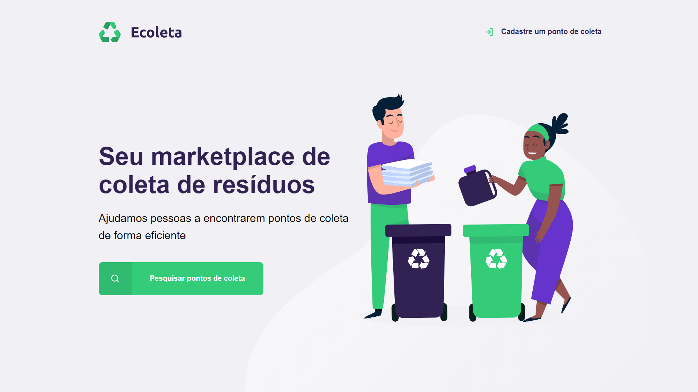
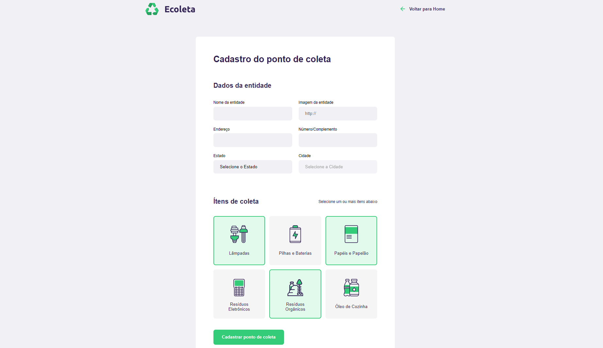
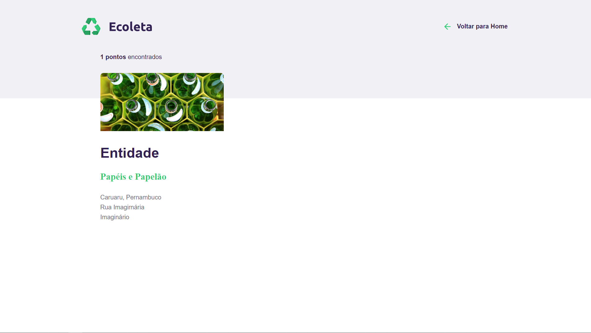

  <h1> Ecoleta Project </h1>
  
   

### O que está sendo aprensentado é um projeto montado pela [Rocketseat](https://rocketseat.com.br/), durante o novo evento chamado **Next Level Week**, com o intuito de ajudar pessoas, dev's, à alavancarem ou iniciarem no mundo da programação com contato direto as melhores e mais ultilizadas tecnologias.

## O Ecoleta
É uma aplicação baseada na Semana do Meio Ambiente, quando eventos para proteção e preservação são impulsionados, para indicação de pontos de coleta de produtos recicláveis com o objetivo de conectar pessoas, empresas e entidades que trabalham para realiza descartes de maneira ecológica e reciclagem de forma efetiva.

    <h3> Home </h3>
    
    <h3> Cadastro de Pontos de Coleta </h3>
    
    <h3> Resultados de Pesquisa </h3>
    

### Tecnologias Ultilizadas - NLW_Starter

#### Linguagem:
- [Javascript](https://developer.mozilla.org/en-US/docs/Web/javascript)

#### Front-end:
- [Nunjucks](https://mozilla.github.io/nunjucks/)
- [HTML 5](http://www.w3.org/TR/html5/)
- [CSS 3](https://www.w3schools.com/Css/)

#### Back-end:

- [NodeJS](https://nodejs.org/)
    - [Express](https://expressjs.com/)
    - [Nodemon](https://nodemon.io/)
- [Git Bash](https://gitforwindows.org)
    ##### Banco de dados
    - [SQL](https://en.wikipedia.org/wiki/SQL)
    - [SQLite3](https://www.sqlite.org/)

#### APIs

- [IBGE](https://servicodados.ibge.gov.br/api/docs/localidades?versao=1)

---
[@Rocketseat](https://github.com/Rocketseat)
[@maykbrito](https://github.com/maykbrito)

#### [Meu Linkedlin](https://www.linkedin.com/in/maria-raquel-3b27531a5/) 